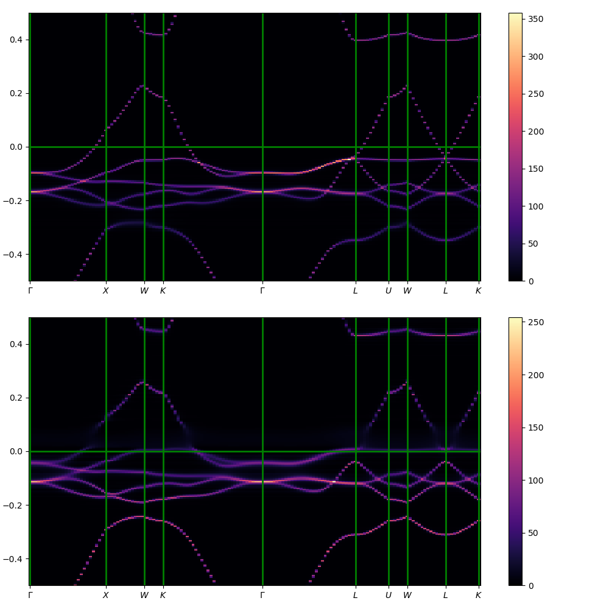

# AkaiKKRPythonUtil
Python utilities for AkaiKKR

- `src/pyakaikkr` (`pyakaikkr`): input-card generation, output parsing, `go/dos/spc/j/tc/fsm/cnd` runner classes, A(w,k)/DOS plotters, GAES, the HTML report, an [ASE calculator](#ase-interface); console scripts `kkr-gaes`, `kkr-report`, `kkr-cmd`.
- `src/akaikkr_testscript` (`akaikkr_testscript`): the per-material test definitions and result comparison used by `tests/testrun`.
- `tests/`: pytest suites (`ase`, `gaes`, `option`, `plot`); `tests/testrun/{akaikkr,akaikkr_cnd,akaikkr_cpa2021v01}`: regression tests of specx against `reference/*.json`.
- `examples/`: GAES examples, the akaikkr_cnd demos, small primitive structures. `scripts/`: survey scripts behind `docs/data`, cif2kkr checks.
- `docs/`: documentation index in [docs/README.md](docs/README.md) (usage of the ASE calculator and the test scripts, the `begin_option` keys, design specs).
- AiiDA: the separate plugin [aiida-akaikkr](../aiida-akaikkr) runs the same test set as AiiDA CalcJobs.

# License

 Copyright (c) 2021-2026 AkaiKKRteam.
 Distributed under the terms of the Apache License, Version 2.0.


# installation
{PREFIX} is the directory you installed AkaiKKRPythonUtil. One `pip install` gives both packages
(`pyakaikkr` and `akaikkr_testscript`) and the console scripts:
```
cd {PREFIX}
pip install .                      # or: pip install -e ".[ase,test,cli]"  (editable, with ase / pytest / click)
```
Extras: `ase` (the ASE calculator), `test` (pytest), `cli` (click, for `kkr-cmd`), `analysis` (scikit-learn, for `scripts/comparemany.py`).

## for the CPA2021V01 user

{AKAIKKRCPA2021V01} is the directory where you installed CPA2021V01.
{AKAIKKRCPA2021V01} can be an absolute or a relative path.

1. Please apply patch to akaikkr_cpa2021v01.
```
$ cd {AKAIKKRCPA2021V01}
$ patch -p1 < {PREFIX}/tests/testrun/akaikkr_cpa2021v01/akaikkr_cpa2021v01.patch
```

The patched cpa2021v01 has 
- 'geom' mode
- Site labels exteded to 40 characters.
- additional information on the "dispersion" files.

2. make specx and fmg in CPA2021V01.
```
$ make specx fmg
```

# test script

The test scripts run AkaiKKR on a fixed set of materials (pure metals, CPA alloys, a semiconductor, SmCo5 with and
without open-core 4f) in every mode (go, fsm, dos, spc31, j3.0, tc, gofmg; cnd for the conductivity build) and compare
the results with reference values. Each material's parameters are defined once in
`akaikkr_testscript.testrun_class` (`_<material>_common_param`) and the structures are generated from CIF files.

| directory | build of AkaiKKR (`<program_path>/<build>/specx`) | reference |
|---|---|---|
| `tests/testrun/akaikkr` | `akaikkr` (standard) | `reference/ifort.json` (62 checks, 13 materials); `reference/ifort_ase.json` for the ASE backend |
| `tests/testrun/akaikkr_cnd` | `akaikkr_cnd` (conductivity: cnd, displc lines) | `reference/ifort.json` (61 checks, 11 materials) |
| `tests/testrun/akaikkr_cpa2021v01` | patched CPA2021V01 (see above) | `reference/ifort.json` (a copy of the `akaikkr` reference; needs regeneration, see the BUG section) |

```
$ conda activate akaikkr          # pyakaikkr, akaikkr_testscript, pymatgen, ase installed
$ cd {PREFIX}/tests/testrun/akaikkr
$ export OMP_NUM_THREADS=24
$ python testrun.py <program_path> [--set <name>] [--create_ref] [--compiler ifort]
$ python testrun_ase.py <program_path> [--set <name>] [--create_ref]        # ASE backend, reference/ifort_ase.json
```

- `<program_path>` is the directory that contains `akaikkr/specx`, `akaikkr_cnd/specx`, `akaikkr_cpa2021v01/specx`.
- `--set` selects a subset defined in `testsets.py` (`all`, `Cu`, `Fe`, `Co`, `Ni`, `NiFe`, `AlMnFeCo`, ...).
- `--create_ref` writes `reference/<compiler>[_ase].json` instead of comparing.
- The outputs of each material stay in `<material>/` (inputcard, `out_*.log`, `dos.png`, `pdos_*.png`, `Awk_*.png`) and
  the values of this run are written to `result.json` (`result_ase.json`); they are not versioned (only `reference/*.json` is). The red dash-dotted line in the DOS figures is
  E − E<sub>F</sub> = −ewidth of the go run (the bottom of the SCF energy contour).
- Details (backends, environment, the known last-digit differences between machines, the fixes of 2026-09):
  [docs/testscript_usage.md](docs/testscript_usage.md).

The following display appears at the end of the execution (here `tests/testrun/akaikkr_cnd`; the `akaikkr` set has no `cnd`
column and includes FeB195 and SmCo5_noc).
```
ALL TESTS PASSED.

SHORT SUMMARY
             cnd dos fsm go gofmg j3.0 spc31 tc
AlMnFeCo_bcc   O   O   O  O     O    O     O  O
Co             -   O   O  O     -    O     O  O
Co2MnSi        -   O   O  O     -    O     O  O
Cu             -   O   -  O     -    -     O  -
Fe             -   O   O  O     -    O     O  O
FeRh05Pt05     O   O   O  O     -    O     O  O
Fe_lmd         -   O   -  O     -    -     O  -
GaAs           -   O   -  O     -    -     O  -
Ni             -   O   O  O     -    O     O  O
NiFe           O   O   O  O     -    O     O  O
SmCo5_oc       -   O   O  O     -    O     O  O
O: passed. X: failed, -: no reference
```
If a check fails, `TEST FAILED.` and the failed keys are printed before the summary. A few checks are known to fail by
the last digit when the machine differs from the one that made the reference (Fe_lmd, SmCo5_oc go moment, AlMnFeCo_bcc
cnd / spc31; docs/testscript_usage.md §4). The thresholds are left as they are.

As an example, the Bloch spectral function $A(w,k)$ of NiFe (FCC $\mathrm{Ni}_{0.9}\mathrm{Fe}_{0.1}$) is generated under the NiFe directory as follows.


## GAES examples in examples/gaes

Two stand-alone examples decide the ewidth of go with GAES (Gap-Anchored Ewidth Search, [docs/gaes_usage.md](docs/gaes_usage.md),
specification [docs/ewidth_tuning_scheme.md](docs/ewidth_tuning_scheme.md)) on a single-site CPA alloy:
```
$ cd {PREFIX}/examples/gaes
$ python gaes_ewidth_example.py <program_path> --comp AlScNiBi --polytyp fcc --min-ewidth 1.0 --max-ewidth 1.5
$ python gaes_orbital_example.py <program_path>            # SeMnFeCo fcc, Se 4s as valence and as core
```
The runs go to `<comp>_<polytyp>_ewidth/`, `SeMnFeCo_fcc_Se4s-valence/`, `SeMnFeCo_fcc_Se4s-core/` and the figures to
`gaes_ewidth_<comp>_<polytyp>.png`, `gaes_orbital_SeMnFeCo_fcc_Se4s.png`.

## pytest

Unit tests of the library live in `tests/` (configured in `pyproject.toml`). Tests marked `specx` are skipped unless
`AKAIKKR_PROGRAM_PATH` (the same `<program_path>`) is set; `pytest -m "not specx"` runs only the offline tests.
```
$ export AKAIKKR_PROGRAM_PATH=/path/to/AkaiKKRprogram.2022.0721.ifort
$ pytest                       # or: pytest tests/gaes, pytest -m "not specx"
```
| directory | what is tested |
|---|---|
| `tests/ase` | the ASE calculator, inputcard generation, occupancies, agreement between the CIF and ASE backends |
| `tests/gaes` | gap detection, Method 2 judgement, orbital rules, compositions, a GAES run with specx (`test_gaes_run.py`, long); `scripts/gaes_survey/` holds the survey scripts behind `docs/data/` |
| `tests/option` | `begin_option` writing / validation / reading back from the outputs |
| `tests/plot` | the array-based drawing functions of `pyakaikkr.plot`, the ewidth line of the DOS plotter, the HTML report (`kkr-report`) |
| `tests/data` | small fixtures shared by the suites (Cu outputs of the akaikkr and akaikkr_cnd builds, an out_go.log) |
| `tests/testrun/structure` | the CIF files of the regression test sets; `examples/small_primitive_structures` holds the CIFs of the GAES survey |

# ASE interface

`pyakaikkr.ase` runs AkaiKKR through an [ASE](https://wiki.fysik.dtu.dk/ase/) calculator (energy, magmom, magmoms; no forces).
Install ase by `pip install ase` (or `pip install "{PREFIX}[ase]"`).

```python
from ase.build import bulk
from pyakaikkr.ase import AkaiKKR, set_occupancy

cu = bulk("Cu", "fcc", a=3.615)
cu.calc = AkaiKKR(directory="cu", command="/path/to/specx < PREFIX.in > PREFIX.out",
                  magtyp="nmag")
print(cu.get_potential_energy())          # eV per cell

# CPA alloy: partial occupancies in the ASE convention (atoms.info["occupancy"])
nife = set_occupancy(bulk("Ni", "fcc", a=3.571), {0: {"Fe": 0.1, "Ni": 0.9}})
nife.calc = AkaiKKR(directory="nife", command="/path/to/specx < PREFIX.in > PREFIX.out",
                    sdftyp="pbeasa", bzqlty=8)
print(nife.get_potential_energy(), nife.get_magnetic_moment())
print(nife.calc.results["component_moments"])   # moment of each component of each type
```

The structure is passed as `brvtyp=aux` with `a=|cell[0]|`. Sites are grouped into AkaiKKR types
when they have the same occupancy and are symmetrically equivalent (spglib).
CIF files with partial occupancies read by `ase.io.read` work as they are.
Partial occupancies cannot come through pymatgen's `AseAtomsAdaptor.get_atoms` (it rejects disordered structures); build them with `set_occupancy` or read the CIF with `ase.io.read`.
See [docs/ase_calculator_usage.md](docs/ase_calculator_usage.md) (usage) and [docs/ase_calculator_spec.md](docs/ase_calculator_spec.md) (design).

The test script can use the ASE backend: run `python testrun_ase.py <program_path> --create_ref`
in `tests/testrun/akaikkr` to make `reference/ifort_ase.json`, then `python testrun_ase.py <program_path>`.
`testrun.py` (pymatgen backend) is unchanged. See [docs/testscript_usage.md](docs/testscript_usage.md) and [docs/testscript_ase_spec.md](docs/testscript_ase_spec.md).

# AiiDA

[aiida-akaikkr](../aiida-akaikkr) wraps specx as AiiDA CalcJobs (go / fsm / dos / j3.0 / tc / spc31 / cnd). Its `example/run_examples.py` uses the same `_<material>_common_param` definitions as the test script and reproduces `tests/*/reference/ifort.json`; see `aiida-akaikkr/docs/`.

# BUG
- `Awk_both.png` is generated at the top directory of testrun.py.
- `tests/testrun/akaikkr_cpa2021v01/reference/ifort.json` is a copy of the `akaikkr` reference and does not match the CPA2021V01
  values (e.g. Cu go te −3304.747251823); it has to be regenerated with `--create_ref`.
- `tests/testrun/akaikkr` Co2MnSi dos / spc31 differ from the reference in te by 1e-5 while go agrees; cause unknown.
